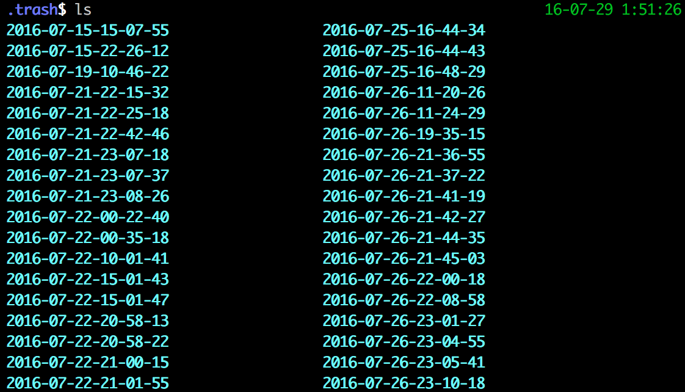

#AstroWheel

All kinds of snippets and wheels for astronomers

## post regulations
0. edit the *posts.md* file instead of the README.md, the README.md is generated by compile.py.
1. Each post need to have a brief title start with level 2 title "## some question"
2. we can make a discription and add some meta data for this posts, like tags.
    Format of tags should be "* tags: tag1, tag2..." just follow the title in the next line
3. Then submitter start a level 4 title with his or her name "#### someone" (to make the text smaller..)
4. And the last is your content.
* the compile.py will auto generate the tags.md and the table of contents below,
    so make sure that you abide by this rules to make it work properly.
* you should run compile.py every time you add or delete a new post. If you do not have python, your can just leave this compile work for others.

Here is an example post.

## some problems title
[//]: # (This is a comment(not show in the home page)
[//]: # (you should not change the title "## some problems title", because the compile.py need it to be this)
* tags: python, blabla, wheel

#### by [someone](https://github.com/someone)
blablabla
blalbalba
here is the code
``` markdown
## some problems about python
* tags: python, blabla, wheel

#### by [someone](https://github.com/someone)
blablabla
blalbalba
here is the code
```

## table of contents
* [prevent neglectful rm -rf](https://github.com/AstroWheel/AstroWheel#prevent-neglectful-rm--rf)
* [good use of git branch](https://github.com/AstroWheel/AstroWheel#good-use-of-git-branch)

## prevent neglectful rm -rf
* tags: shell, rm

how to prevent neglectful rm -rf?

#### by [Fmajor](https://github.com/someone/Fmajor)
* description: mv the things to ~/.trash/\<data-time\>
* disadvantages: you should clean your .trash using rmSure from time to time

code:
```bash
alias rmSure=/bin/rm
alias rm=trash
trash()
{
    tempDir=~/.trash/`date +%Y-%m-%d-%H-%M-%S`
    mkdir -p $tempDir
    mv -f $@ $tempDir
}
```
my trash:


## good use of git branch
* tags: git, github, version control

how to manage git branches efficiently?

#### by [Fmajor](https://github.com/someone/Fmajor)

see
* [A successful Git branching model](http://nvie.com/posts/a-successful-git-branching-model/)
* [gg: good use of git,一个实用的git分支模型](http://fmajor.lamost.org/blog/2014/08/08/gg.html)
* [gg](https://github.com/Fmajor/gg)
* [gitflow](https://github.com/nvie/gitflow)

## prevent neglectful rm -rf
* tags: shell, rm

how to prevent neglectful rm -rf?

#### by [Fmajor](https://github.com/someone/Fmajor)
* description: mv the things to ~/.trash/\<data-time\>
* disadvantages: you should clean your .trash using rmSure from time to time

code:
```bash
alias rmSure=/bin/rm
alias rm=trash
trash()
{
    tempDir=~/.trash/`date +%Y-%m-%d-%H-%M-%S`
    mkdir -p $tempDir
    mv -f $@ $tempDir
}
```
my trash:


## good use of git branch
* tags: git, github, version control

how to manage git branches efficiently?

#### by [Fmajor](https://github.com/someone/Fmajor)

see
* [A successful Git branching model](http://nvie.com/posts/a-successful-git-branching-model/)
* [gg: good use of git,一个实用的git分支模型](http://fmajor.lamost.org/blog/2014/08/08/gg.html)
* [gg](https://github.com/Fmajor/gg)
* [gitflow](https://github.com/nvie/gitflow)

